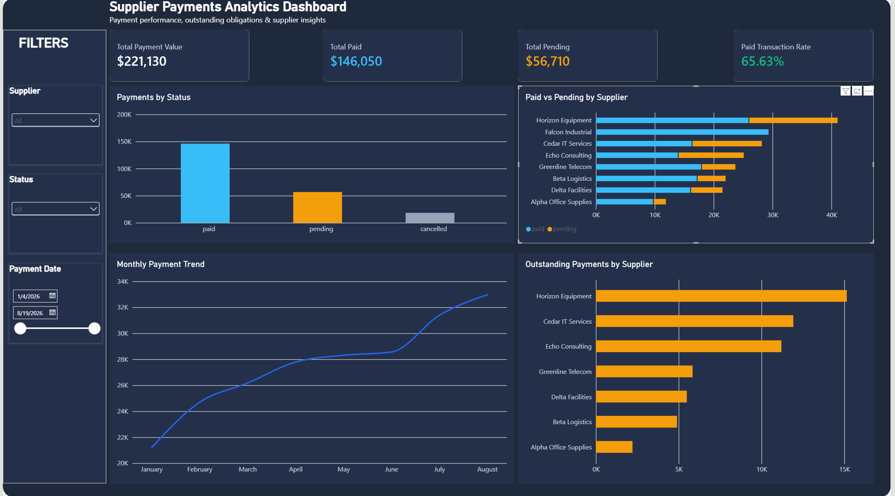

# Supplier Payments Analysis

A PostgreSQL and Power BI portfolio project focused on supplier payment activity, outstanding obligations, payment status, and supplier-level financial KPIs.

## Dashboard preview



*Interactive Power BI dashboard built from the included supplier-payment dataset, with KPI cards, status analysis, supplier comparisons, monthly trends, outstanding balances, and interactive filters.*

## Project overview

This project analyzes a reproducible supplier-payment dataset to answer practical finance and operations questions. The workflow starts with transactional payment data in PostgreSQL, transforms it into business KPIs with SQL, and presents the results in an interactive Power BI dashboard.

The included dataset is synthetic and contains no private company or supplier information.

## Business questions

The analysis is designed to answer questions such as:

1. How much has been paid, and how much is still pending?
2. What percentage of transactions have been completed successfully?
3. Which suppliers have the highest paid and outstanding amounts?
4. How does payment activity change over time?
5. Which suppliers have repeated pending or cancelled payments?
6. What are the latest and largest payments for each supplier?
7. How are payments distributed across small, medium, and large transaction sizes?

## Sample dataset

The included sample contains **64 supplier payments** across **8 suppliers** and **8 months**.

Sample-level metrics:

- **Total payment value:** $221,130
- **Total paid:** $146,050
- **Total pending:** $56,710
- **Cancelled value:** $18,370
- **Paid transactions:** 42
- **Pending transactions:** 16
- **Cancelled transactions:** 6
- **Paid transaction rate:** 65.6%

These figures describe only the included synthetic sample.

## What this project demonstrates

- PostgreSQL data analysis
- Aggregations with `SUM`, `COUNT`, `AVG`, `MIN`, and `MAX`
- Conditional aggregation using `CASE`
- Filtering grouped results with `HAVING`
- Common Table Expressions (`CTEs`)
- Window functions including `ROW_NUMBER()` and `DENSE_RANK()`
- Supplier-level KPI calculation
- Monthly payment trend analysis
- Outstanding-payment analysis
- Interactive dashboard development in **Power BI**
- DAX measures and report-level filtering
- Business-focused data visualization and KPI communication

## Analytical workflow

1. Load `data/supplier_payments.csv` into PostgreSQL.
2. Validate payment dates, amounts, supplier IDs, and status values.
3. Calculate overall payment KPIs.
4. Aggregate payment activity by supplier and status.
5. Analyze monthly payment trends.
6. Use CTEs to compare paid and pending balances.
7. Use window functions to rank payments within each supplier.
8. Prepare supplier and monthly summaries for Power BI visualization.
9. Build an interactive Power BI dashboard with KPI cards, slicers, and supplier-level analysis.

## Project structure

```text
.
├── README.md
├── data/
│   ├── README.md
│   └── supplier_payments.csv
├── sql/
│   ├── schema.sql
│   ├── analysis.sql
│   └── power_bi_views.sql
├── power-bi/
│   └── README.md
└── assets/
    ├── README.md
    └── dashboard-overview.png
```

## PostgreSQL setup

Create the table by running:

```text
sql/schema.sql
```

Then import:

```text
data/supplier_payments.csv
```

into the `supplier_payments` table using pgAdmin, PostgreSQL `COPY`, or your preferred import workflow.

Run the analysis queries from:

```text
sql/analysis.sql
```

Optional reporting views for Power BI are available in:

```text
sql/power_bi_views.sql
```

## Power BI dashboard

The completed dashboard includes:

- **Total Payment Value**
- **Total Paid**
- **Total Pending**
- **Paid Transaction Rate**
- **Payments by Status**
- **Paid vs Pending by Supplier**
- **Monthly Payment Trend**
- **Outstanding Payments by Supplier**
- Interactive **Supplier**, **Status**, and **Payment Date** filters

The dashboard uses a dark analytics theme with consistent status colors to make paid, pending, and cancelled activity easy to compare.

## Key analytical concepts

### Conditional aggregation

`CASE` expressions are used inside aggregation functions to calculate paid, pending, and cancelled transaction counts and amounts without splitting the data into separate tables.

### CTEs

CTEs create readable intermediate supplier summaries before comparing paid and pending balances or filtering suppliers with material outstanding amounts.

### Window functions

`ROW_NUMBER()` identifies the latest or largest payment within each supplier while retaining transaction-level detail. `DENSE_RANK()` ranks suppliers by outstanding balance.

## Portfolio note

This project demonstrates a business-oriented Data Analyst workflow: starting with transactional data in PostgreSQL, defining useful financial KPIs, answering supplier-payment questions with SQL, and presenting the results in an interactive Power BI dashboard.
